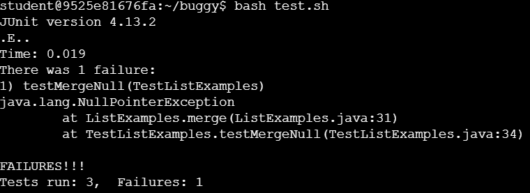
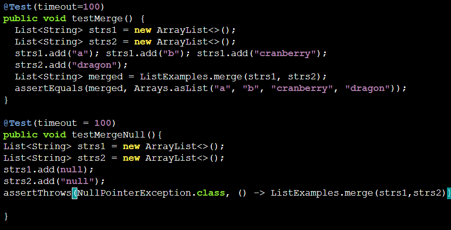
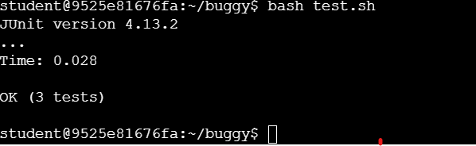
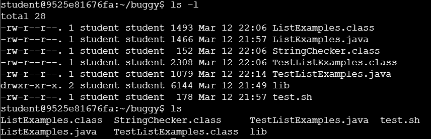
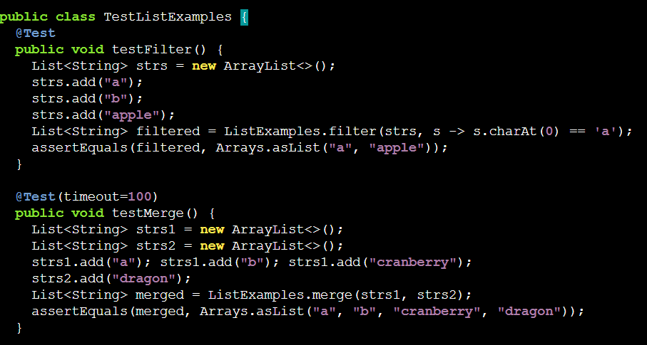

**Lab Report 5 Putting it All Together! **

**CSE15L W24
–
Ed Discussion**

**Context**: I used a reference from practice skill demo 4 then wrote a new test, and break, adjusting the code to adapt to the added bug. 

**Student1** is working on an assignment for a graded assignment, the actual assignment has a different failure-inducing output compared to the practice. So now student1 is seeking help from the TA.

**Student1:** Hi, Im working on edstem and after I ```cd buggy``` I called ```bash grade.sh```. Hoping to find the bugs within the implementation of ListExamples.java

this is the failure-inducing output.



This is the method ```merge()```

```
static List<String> merge (List<String> list1 , List<String> list2) {
  List<String> result = new ArrayList<>();
  int index1 = 0, index2 = 0;
  while(index1 < list1.size() && index 2  < list2.size()){
    if(list1.get(index1).compareTo(list2.get(index2)) < 0) {
      result.add(list1.get(index1));
      index1 +=1;
    }
    else {
      result.add(list2.get(index2));
      index1 +=1;
    }
  }
  while(index1 < list1.size()) {
    result.add(list1.get(index1));
    index1 += 1
  }
  while(index1 < list1.size()) {
    result.add(list1.get(index1));
    index1 += 1
  }
  return result;
}

```

**Student1:** Previously, I've only worked on simple bugs such as a syntax or unbound identifier error which only requires me to review and update the code briefly.

**TA**: From the provided failure-inducing input, there seems to be a new exception being thrown called ```NullPointerException```. Which can be thrown on different occasions, such as calling a method on a null object reference, Using the return value of a method that returns null without checking for null first,...

**Student1:** Here is the ```testMergeNull()``` which has somewhat similar content as the ```testMerge()``` given in the practice skill demo.

```
@Test(timeout = 100)
  public void testMergeNull(){
  List<String> strs1 = new ArrayList<>();
  List<String> strs2 = new ArrayList<>();
  strs1.add(null);
  strs2.add("null");
  assertThrows(NullPointerException.class, () -> ListExamples.merge(strs1,strs2));
  }
```

**TA**: It seems that the test has called for ```strs1.add(null)``` and it doesnt seems to include ```@Test(expected = NullPointerException.class)```. This means that you should alter your code so that it would throw an exception if there is a ```null``` element being added. Which should look like this.

```
/* This is only an example with random variables, make sure you use your variable when implementing it.*/
if( a == null) {
  throw new NullPointerException();
}
```

Then call ```bash test.sh``` again, Run the following tests and let me know if they pass.



**Student1**: Thank you, I've implemented the following suggestions and the new Test.



**The file & directory structure needed:** The only 2 files that were edited ```TestListExamples.java``` and ```List Examples.java```




```TestListExamples.java```



**The contents of each file before fixing the bug**: 


**Before** ```ListExamples.java``` 

```
static List<String> merge (List<String> list1 , List<String> list2) {
  List<String> result = new ArrayList<>();
  int index1 = 0, index2 = 0;
  while(index1 < list1.size() && index 2  < list2.size()){
    if(list1.get(index1).compareTo(list2.get(index2)) < 0) {
      result.add(list1.get(index1));
      index1 +=1;
    }
    else {
      result.add(list2.get(index2));
      index1 +=1;
    }
  }
  while(index1 < list1.size()) {
    result.add(list1.get(index1));
    index1 += 1
  }
  while(index1 < list1.size()) {
    result.add(list1.get(index1));
    index1 += 1
  }
  return result;
}

```

**After:** 

```
static List<String> merge(List<String> list1, List<String> list2) {
  if(list1 == null || list2 == null){ /**
    throw new NullPointerException();  * Added section
  }                                    */
  List<String> result = new ArrayList<>();
  int index1 = 0, index2 = 0;
  while(index1 < list1.size() && index2 < list2.size()) {
  if(list1.get(index1).compareTo(list2.get(index2)) < 0) {
    result.add(list1.get(index1));
      index1 += 1;
  }
  else {
      result.add(list2.get(index2));
      index2 += 1;
  }
  }
  while(index1 < list1.size()) {
      result.add(list1.get(index1));
      index1 += 1;
    }
  while(index2 < list2.size()) {
      result.add(list2.get(index2));
      index2 += 1;
    }
    return result;
  }


}
```

**The full command line (or lines) you ran to trigger the bug**

**content of test.sh**

```
set -e

javac -cp .:lib/hamcrest-core-1.3.jar:lib/junit-4.13.2.jar *.java

java -cp .:lib/hamcrest-core-1.3.jar:lib/junit-4.13.2.jar org.junit.runner.JUnitCore TestListExamples

```

Some other commands being used were ```vim``` , ```javac, java``` and ```cd, cd ..```,...

**A description of what to edit to fix the bug** 

**Summary**: 
```vim ListExamples``` were called then using the cursor, go to ```merge()``` at around line 26. Next of, use ```i``` and insert 

```
if(list1 == null || list2 == null){ /**
    throw new NullPointerException();  * Added section
  }
```

After that, ```javac``` and call ```bash test.sh```.

Part 2: Reflection 

The technical aspect of the lab was very eye-opening and has allowed me to make major improvements in my coding skills. Being able to attend these labs, work with my classmates, and actually run tests, de-bugging and fixing bugs together made me feel like it's the closest environment I've had so far that resemblance an actual workplace. Where people work as a team, with the help of the Ta's aka professionals. I'm just very grateful for the experience and hope my future classes are similar in teaching style and working environment. 


