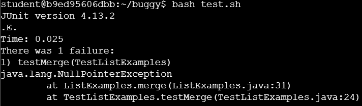

**Lab Report 5**

**CSE15L W24
–
Ed Discussion**

**Context**: student1 is working on an assignment for skill demo, the skill demo has a different failure-inducing output compared to the practice. So now student1 is seaking help from the TA.

**Student1:** Hi, Im working on edstem and after calling the command

```bash grade.sh```

this is the failure-inducing output.



This is the method ```merge()```

```
static List<String> merge (List<String> list1 , List<String> list2) {
  List<String> result = new ArrayList<>();
  int index1 = 0, index2 = 0;
  while(index1 < list1.size() && index 2  < list2.size()){
    if(list1.get(index1).compareTo(list2.get(index2)) < 0) {
      result.add(list1.get(index1));
      index1 +=1;
    }
    else {
      result.add(list2.get(index2));
      index1 +=1;
    }
  }
  while(index1 < list1.size()) {
    result.add(list1.get(index1));
    index1 += 1
  }
  while(index1 < list1.size()) {
    result.add(list1.get(index1));
    index1 += 1
  }
  return result;
}

```

**Student1:** Previously, I've only worked on simple bugs such as a syntax or unbound identifier error which only requires me to review and update the code briefly.

**TA**: From the provided failure-inducing input, there seems to be a new exception being thrown called ```NullPointerException```. Which can be thrown on different occasions, such as calling a method on a null object reference, Using the return value of a method that returns null without checking for null first,... Could you provide the test method being used?

**Student1:** Here is the ```testMergeNull()``` which has somewhat similar content as the ```testMerge()``` given in the practice skill demo.

```
@Test(timeout = 100)
public void testMergeNull() {
  List<String> strs1 = new ArrayList<>();
  List<String> strs2 = new ArrayList<>();
  strs1.add(null); strs1.add("b"); strs1.add("cranberry");
  strs2.add("dragon");
  List<String> merged = ListExamples.merge(strs1, strs2);
  assertEquals(merged, Arrays.asList("a", "b", "cranberry", "dragon));
```

**TA**: It seems that the test has called for ```strs1.add(null)``` and it doesnt seems to include ```@Test(expected = NullPointerException.class)```. This means that you should alter your code so that it would throw an exception if there is a ```null``` element being added. Which should look like this.

```
/* This is only an example with random variables, make sure you use your variable when implementing it.*/
if( a == null) {
  throw new NullPointerException();
}
```

and your @Test should look like this 


**Student1**: Thank you, I've implemented the following suggestions and the new Test.


Part 2: Reflection 

The techinical aspect of lab was very eye opening and has allowed me to make major improvements towards my coding skill. Being able to attend these labs, working with my classmates and actually run tests, de bugging and fixing bugs together made me feel like its the closest enviroment I've had so far that remsemblance an actual work place. Where people work as a team, with help of the Ta's aka profensionals. Im just very gratefull for the experience and hoping my future classes are similar in teaching style and working enviroment. 


