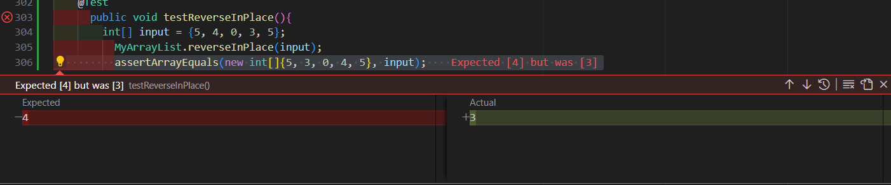
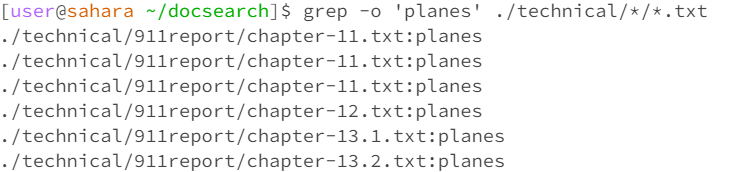

**Lab report 3**

**Part 1: Bugs**
Provide:

// Changes the input array to be in reversed order
```
static void reverseInPlace(int[] arr) {
  for (int i = 0; i < arr.length; i++) {
    arr[i] = arr[arr.length - i - 1];
  }
}
```

**Failure Inducing Input**                   

```
public void testReverseInPlace(){
  int[] input = {5, 4, 0, 3, 5};
    ArrayExamples.reverseInPlace(input);
    assertArrayEquals(new int[]{5, 3, 0, 4, 5 input);
  }
 ```

**Non-Failure Inducing Input**     

```
@Test
  public void testNonFailureInducing() {
    int[] input = {5, 4, 0, 4, 5};
    ArrayExamples.reverseInPlace(input);
    assertArrayEquals(new int[]{5, 4, 0, 4, 5}, input);
  }
```

**Test Symptoms:**



**Original code**

```
static void reverseInPlace(int[] arr) {
  for (int i = 0; i < arr.length; i++) {
    arr[i] = arr[arr.length - i - 1];
  }
}
```

Fixed Code

```
static void reverseInPlace(int[] arr) {
  for (int i = 0; i < arr.length; i++) {
    int temp = arr[i];
    arr[i] = arr[arr.length - i - 1];
    arr[arr.length - i - 1] = temp;
  }
}
```

~ The ```reverseInPlace``` method is intended to reverse the input ```int[]``` array in place.

~ By using a for loop to traverse the first half of the array and saving it at the index in an ```int``` variable, ```temp```

~ Then replace the value at each index in the first half of the array with the value at index ```arr.length - i - 1```.


**Part 2 - Researching Commands**

**Find 4 interesting commands**

**command 1: ```grep -o 'pattern' filename```**

~Using this command prints out the pattern if it's found in the ```<pattern>``` file argument.
~Using this command helps you look for specified data and keep track of reoccurring patterns.



~ This is a demonstration of using ```grep -o 'plane' ./technical/*/*.txt


                      


                      
                      
          
                      
                    

