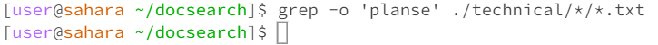
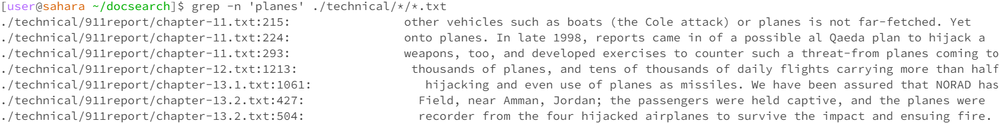
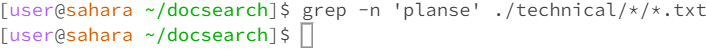
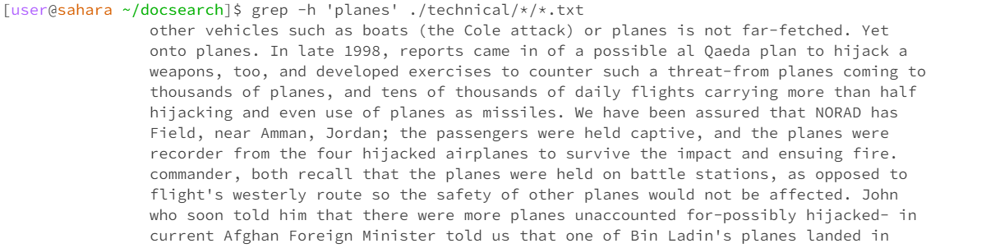
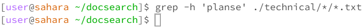
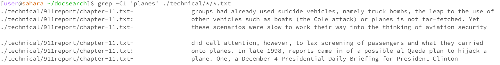
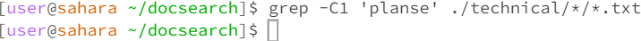

**Lab report 3**

**Part 1: Bugs**
Provide:

// Changes the input array to be in reversed order
```
static void reverseInPlace(int[] arr) {
  for (int i = 0; i < arr.length; i++) {
    arr[i] = arr[arr.length - i - 1];
  }
}
```

**Failure Inducing Input**                   

```
public void testReverseInPlace(){
  int[] input = {5, 4, 0, 3, 5};
    ArrayExamples.reverseInPlace(input);
    assertArrayEquals(new int[]{5, 3, 0, 4, 5 input);
  }
 ```

**Non-Failure Inducing Input**     

```
@Test
  public void testNonFailureInducing() {
    int[] input = {5, 4, 0, 4, 5};
    ArrayExamples.reverseInPlace(input);
    assertArrayEquals(new int[]{5, 4, 0, 4, 5}, input);
  }
```

**Test Symptoms:**


**Original code**

```
static void reverseInPlace(int[] arr) {
  for (int i = 0; i < arr.length; i++) {
    arr[i] = arr[arr.length - i - 1];
  }
}
```

Fixed Code

```
static void reverseInPlace(int[] arr) {
  for (int i = 0; i < arr.length; i++) {
    int temp = arr[i];
    arr[i] = arr[arr.length - i - 1];
    arr[arr.length - i - 1] = temp;
  }
}
```

~ The ```reverseInPlace``` method is intended to reverse the input ```int[]``` array in place.

~ By using a for loop to traverse the first half of the array and saving it at the index in an ```int``` variable, ```temp```

~ Then replace the value at each index in the first half of the array with the value at index ```arr.length - i - 1```.


**Part 2 - Researching Commands**

**Find 4 interesting commands**

Source: ```man grep```

**command 1: ```grep -o 'pattern' filename```**

~Using this command prints out the pattern if it's found in the ```<pattern>``` file argument.

~Using this command helps you look for specified data and keep track of reoccurring patterns.

~ This is a demonstration of using ```grep -o 'plane' ./technical/*/*.txt```.

~ ```grep -o 'planes' ./technical/*/*.txt``` prints out all the files that contain the word "planes" inside the directory ```technical```'s files


~ This is a demonstration of using ```grep -o 'planse' ./technical/*/*.txt```.



```~ grep -o 'planse' ./technical/*/*.txt``` prints out all the files that contain the word "planes" inside the directory ```technical files```. But in this case, the word ```planes``` was not found anywhere resulting in an empty output.


**command 2: ```grep -n 'pattern' filename```**

Source: ```man grep```


~Using this command prints out the line and its number, that contains the ```'pattern'```.

~Using this command helps you find the location of the matching pattern and could be useful for dealing with bugs, by printing out the exact line number. 

~ This is a demonstration of using ```grep -n 'planes' ./technical/*/*.txt``` 

~ ```grep -n 'planes' ./technical/*/*.txt``` prints out all the lines that has ```planes``` and the line's number



~ This is a demonstration of using ```grep -n 'planse' ./technical/*/*.txt``` 



```~ grep -n 'planse' ./technical/*/*.txt``` prints out all the lines that contain the word "planes" inside the directory ```technical files```. But in this case, the word ```planse``` was not found anywhere resulting in an empty output.

**command 3: ```grep -h 'pattern' filename```**

Source: ```man grep```


~ Using this command prints out the patterns if found in the file argument in the form ```<pattern>```
~ Using this command helps with analyzing the pattern and reducing output clutter
~ This is a demonstration of using ```grep -h 'planes' ./technical/*/*.txt``` 



~```grep -h 'planes' ./technical/*/*.txt``` search for the word ```planes``` and will return and print out the file if found. 

~ This is a demonstration of using ```grep -h 'planse' ./technical/*/*.txt``` 



```~ grep -h 'planse' ./technical/*/*.txt``` prints out the files that contain the word "planes" inside the directory ```technical files```. But in this case, the word ```planse``` was not found anywhere resulting in an empty output.

**command 4: ```grep -Cn 'pattern' filename```**

Source: ```geeksforgeeks```

~ Using this command print out the line that contains ```'pattern'``` and ```n``` line(s) after ```-C``` if found.

~ This is a very helpful command to look for certain blocks of codes or data that are related by returning the line that contains ```pattern``` and the ```n``` line(s) after that. 

~ This is a demonstration of using ```grep -n 'planse' ./technical/*/*.txt``` 



~ This is a demonstration of using ```grep -Cn 'planse' ./technical/*/*.txt``` 



~Because the word ```planse``` isnt found anywhere so therefore no output is available as so at the lines after that


                      


                      
                      
          
                      
                    

