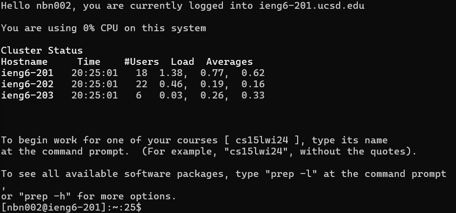
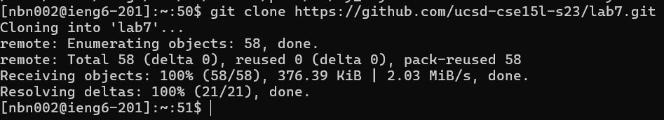
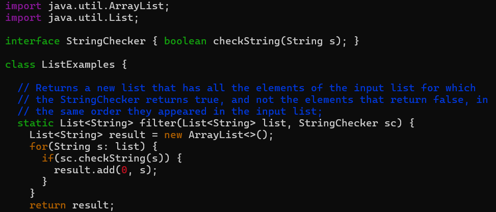
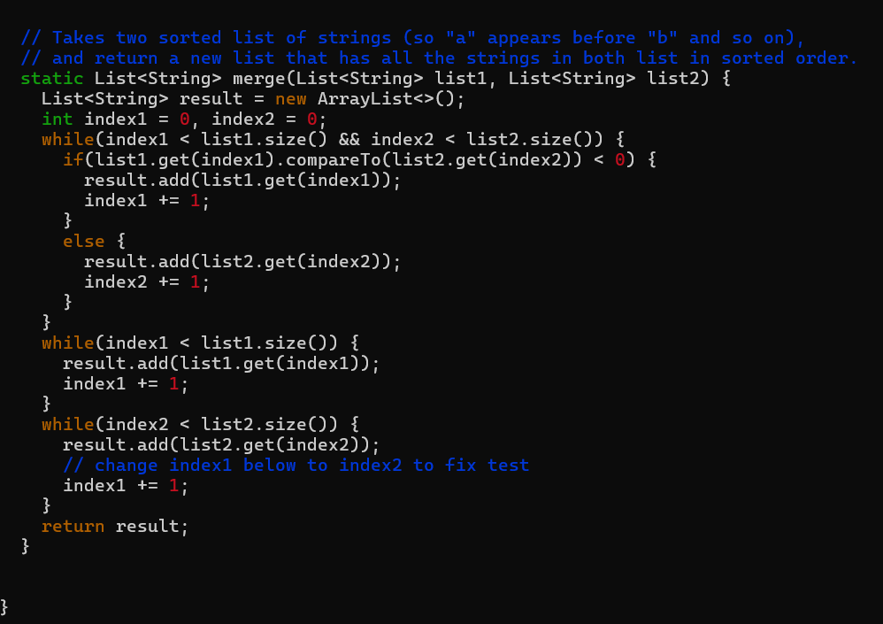
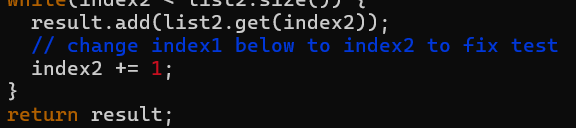
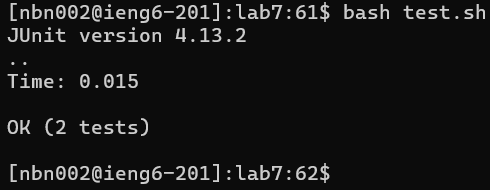
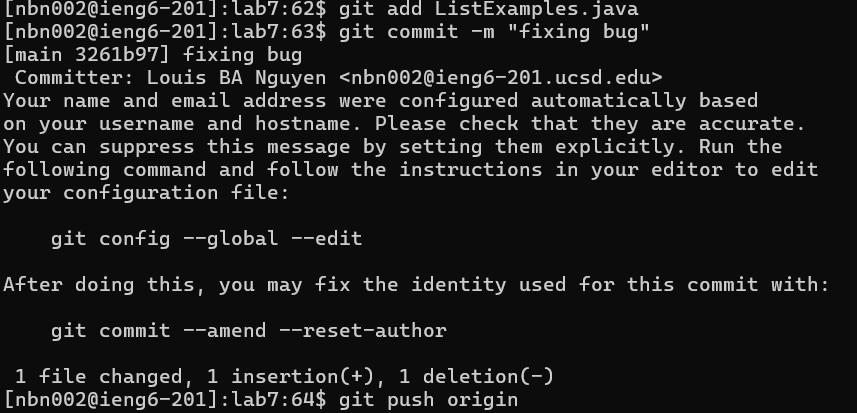

**Lab Report 4**

**Log In: ```ieng6```**

~Ater typing ```ssh nbn002@ieng6.ucsd.edu``` and entering my ```password``` follow with the ```<enter>``` key.



**Git Clone: ```$ git clone https://github.com/ucsd-cse15l-s23/lab7```**

~Here, I cloned ```https://github.com/ucsd-cse15l-s23/lab7.git``` and hit ```<enter>```.



**Testing for bug(s)**

~After ```cd lab7```, ```bash test.sh``` was called resulting in the following display. 


**Finding and Fixing Bug**

~By using ```vim ListExamples.java``` and ```<enter>```




~To access and fix the bug from the initial position of the cursor being at the bottom, I clicked ```<up><up><up><up><up><up>``` and ```<right><right><right><right><right><right><right><right><right>```. Then using ```x``` I deleted the number ```1```. Inserting ```2``` into to previous position of the removed index using ```i``` following with ```2```.



~To save my changes, ```esc``` was called following ```:wq``` which save file and exit the ```vim```.

**Testing the changes we made**

~ Running ```test.sh``` by calling ```bash tesh.sh``` then hit ```<enter>```



**Saving the changes we made**

~ To save the changes we have made so far there are 3 steps: adding ListExamples.java, then committing the changes and lastly pushing it to the remote repository

~ ```git add ListExamples.java```, then hit ```<enter>```. Then ```git commit -m "fixing buy"```, note the ```"fixing bug"``` is a message, then ```<enter>```. Finally, ```git push origin``` and ```<enter>```.

~All steps are demonstrated below:




