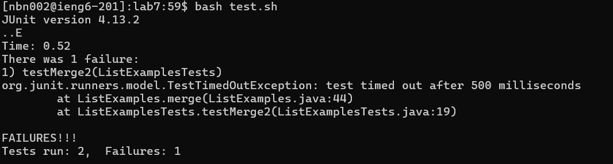

**Lab Report 4**

**Log In: ```ieng6```**

~Ater typing ```ssh nbn002@ieng6.ucsd.edu``` and entering my ```password``` follow with the ```<enter>``` key.


**Git Clone: ```$ git clone https://github.com/ucsd-cse15l-s23/lab7```**

~Here, I cloned ```https://github.com/ucsd-cse15l-s23/lab7.git``` and hit ```<enter>```.


**Testing for bug(s)**

~After ```cd lab7```, ```bash test.sh``` was called resulting in the following display. 



**Finding and Fixing Bug**

~By using ```vim ListExamples.java``` and ```<enter>```


~To access and fix the bug from the initial position of the cursor being at the bottom, I clicked ```<up><up><up><up><up><up>``` and ```<right><right><right><right><right><right><right><right><right>```. Then using ```x``` I deleted the number ```1```. Inserting ```2``` into to previous position of the removed index using ```i``` following with ```2```.


