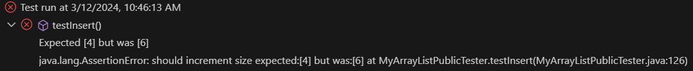

**Lab Report 5**

**CSE15L W24
–
Ed Discussion**

Student1 : I'm implementing an ```insert``` method for a class called ```MyArrayList.java``` and running tests on it.

this is my code for ```insert```. I'm currently using ```VS code``` with ```JUnit``` testing.

```
/**
     * Add an element at the specified index
     *
     * @param index   position to insert the element
     * @param element the element to insert
     */
     public void insert(int index, E element){
        if(index < 0 || index > values.length){
           throw new IndexOutOfBoundsException(); 
        }
        if(length == values.length){
           expandCapacity(length+1);
        }
        for(index = length; index > 0; index-- ){
            values[index] = values[index-1];
        length++
        }
        values[index] = element;

    }
```

Student1: Here are the failure-inducing input



Student1: I have added ```expandCapacity()``` and ```length++``` to make sure that the size will change accordingly based on the input but for some reason, its still not passing.

This is the ```@Test``` used for testing my ```insert()``` method

```
    /**
     * Tests Insert method when an element is inserted at the end
     */
    @Test
    public void testInsert() {
        listWithInt.insert(0, 10);
        listDefaultCap.insert(0, 10);

        assertArrayEquals("check data", 
        new Integer[]{10, 1, 2, 3, null, null}, listWithInt.values);
        assertEquals("should increment size", 4, listWithInt.length);

        assertArrayEquals("check data", 
        new Integer[]{10, null, null, null, null}, listDefaultCap.values);
        assertEquals("should increment size", 1, listDefaultCap.length);
    }
```


TA's: 

